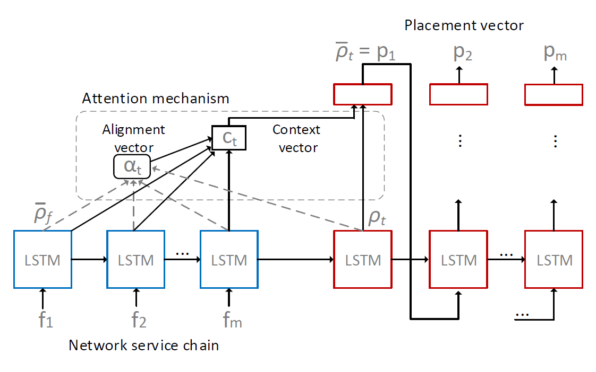

# vnf_placement_optimization_rl
Virtual Network Function placement optimization with Deep Reinforcement Learning

<p align="center">
  

# Paper
 Pending to be published...
  
# Requirements 

- Python 3.6
- Tensorflow 1.8.0
- Minizinc 2.1.1 (optional -> --enable_performance)
````
    pip install -r requirements.txt
````
# Usage

Learn your own model from scratch (model available in default location *save/model_1*):
```
    python main.py --learn_mode=True --save_model=True
```

Continue learning a previously saved model:
```
    python main.py --learn_mode=True --save_model=True --load_model=True
```

Test pretained model performance:
```
    python main.py --learn_mode=False --save_model=False --load_model=True (--enable_performance=True)
```

# Debug

To visualize training variables on Tensorboard:
```
    tensorboard --logdir=summary/repo
```

To activate Tensorflow debugger in Tensorboard, uncomment TensorBoard Debug Wrapper code. Execute Tensorboard after running the model.
```
    tensorboard --logdir=summary/repo --debugger_port 6064
```
# Results

The models used in the paper are stored in *save/model/*, to test them agains Gecode solver run the script:    
```
    script_test
```

The output from *script_test* are the *test.csv* files, which are also available in *save/*. To visualize the comparison between Gecode and the neural network model run:
```
    python graphicate_test.py -f save/model_test.csv
```

To learn the models used in the paper from scratch run the script:
```
    script_learning
```
The learning process is monitored in a *learning_history.csv* file, available in *save/model/*. To visulize the learning process run:
```
    python graphicate_learning.py -f save/model/learning_history.csv
```

# Miscelanea

Test Minizinc instalation solving the model *placement.mzn* fed with demo input data *placement.dzn*:
```
    minizinc  placement.mzn placement.dzn  -a
```

# Author

Ruben Solozabal, PhD student at the University of the Basque Country (UPV/EHU) - Bilbao

Date: June 2019

Contact me: rubensolozabal@gmail.com
